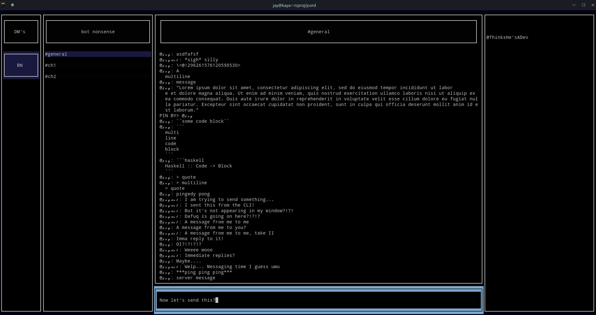

# JCORD - UNOFFICIAL DISCORD CLIENT
*An unofficial Discord client (only for bot accounts), written in C++, using the [sleepy-discord](https://github.com/yourWaifu/sleepy-discord) library.*



## Requirements
 1. **A Discord bot account:**  
    1. Go to https://discord.com/developers/applications and create a new Application using the blue button on top, then give it a nice name (this will be the "username" of your bot account; yes, you can change it later).  
    1. Go to the "Bot" tab (on the left side), and hit the blue button saying "Add bot" (on the right side), then confirm your choice in the next window.  
    1. Click the blue ``Copy`` button to copy your token (**keep this secret!** It's basically your bot's password...). You won't need it right away, but you'll need it soon.  
 1. **A C++ compilation stack:** if you don't know what this is, don't freak out just yet.  
    * On Linux/Unix: I recommend installing GCC, Make and CMake (which may already be pre-installed for you) using your local package manager.  
    * On Windows: I recommend using [Cygwin](https://cygwin.com/install.html); this will make things easier for the next steps. Make sure to add at least the ``gcc``, ``cmake``, ``make`` and ``ncurses`` packages.
 1. **NCurses:** At the moment, we use the ncurses system as our UI backend (to get that nice hackerman look), so make sure to install the library.  
    * On Linux/Unix: Once again, install libncurses (please check if your distribution has the same name for the ncurses library) using your package manager.  
    * On Windows: If you installed Cygwin earlier, you should already have it!  
 1. **Sleepy-Discord:** you can download/clone this repository from [GitHub](https://github.com/yourWaifu/sleepy-discord/).  
 1. **ClipboardXX:** you can download/clone this repository from [GitHub](https://github.com/Arian8j2/ClipboardXX) as well.
 1. **JCord:** you have to download/clone this repository as well, obviously!  

## Building
*If you've downloaded all required components/tools, and you're on Linux/Unix, then you can use the (bash) script in ``helpers/setup.bash`` to build JCord from scratch.*  
Once you've downloaded all the required tools and repositories, you can get started on building:  
 1. In the JCord directory, create a two new directories: one called ``libs`` and one called ``out``.  
 1. Copy the entire sleepy-discord directory (it should contain a ``buildtools``, ``deps``, ``examples``, ``include`` and ``sleepy_discord`` directory) into your newly created ``libs`` directory.  
 1. Copy the entire ClipboardXX directory (it should contain a ``examples`` and ``include`` directory) to your ``libs`` directory.
 1. Create a new file, ``src/token.cpp`` in the JCord directory, and put the following code into it:  
    ```cpp
    #ifndef JCORD_TOKEN
    #define JCORD_TOKEN

    #include "headers/token.h"

    std::string getToken()
    {
        return "<your token>";
    }

    #endif
    ```
    Where you replace ``<your token>`` by your bot's token (see above). This ensures the bot will login upon starting.  
 1. The next few steps are taken from the command line (yes, get that hackerman feeling!), so please open your favorite terminal (Unix/Linux) or Cygwin (or WSL, on Windows). Next, run the following commands, one by one:  
    ```sh
    cd "<install location of jcord>/out/"
    cmake ..
    make jcord
    ```  
    If everything went well, the last few lines should look like this:  
    ```
    [ 97%] Linking CXX executable jcord
    [100%] Built target jcord
    ```

If you got this far, congratulations! You can now actually use JCord to have fun and show off your super awesome new Discord client to your friends!

## Running
To actually run JCord, you will need to open up a terminal each time. When it's open, once again run the ``cd "<install location of jcord>/out/"`` command, and then start JCord with the simple command ``./jcord``.  
**Warning:** bots can't accept invite links, so you have to ask the server owner each time to add the bot to the server. Maybe this will change or maybe Discord will allow non-bot clients, but at the moment, this is an annoying limitation. Invite links can be generated quite easily:  
 1. Go once again to https://discord.com/developers/applications.  
 1. Choose the bot you made.  
 1. Go to ``OAuth2``.  
 1. In the ``Scopes`` panel, check the ``bot`` box, and then click the blue copy button.  
 1. You now have an invite link for your bot. If a server admin opens the link, they can add you(r bot) to the server!

## Configuring
At the moment, configuring is done before building the library, but you might want to make sure you're able to build before spending a lot of time on configuring JCord (cause each time you change the configuration, you have to rebuilt it).  
*Note:* This is going to change, but not right now...  
**Warning:** if you change certain settings, you might break some stuff, so be careful! Always make a backup of the original file you change!  
### Changing colors
This is the easiest (and probably also the safest) part.  
All the settings for this are in the file ``src/headers/color.h``. It should look like this now:  
```cpp
#ifndef JCORD_COLOR_H
#define JCORD_COLOR_H

#include <ncurses.h> //required for color macros

//use default terminal colors for OFF
#define USE_DEFAULT 0

//if no color redefinitions
#define DEFAULT_OFF_BACK COLOR_BLACK
#define DEFAULT_OFF_FRONT COLOR_WHITE
#define DEFAULT_SHROUD_BACK COLOR_BLUE
#define DEFAULT_SHROUD_FRONT COLOR_WHITE
#define DEFAULT_ON_BACK COLOR_BLUE
#define DEFAULT_ON_FRONT COLOR_CYAN

//if color redefinitions
#define USE_CHANGED 1
#define CHANGED_OFF_BACK_INDEX 10
#define CHANGED_OFF_BACK_R 010
#define CHANGED_OFF_BACK_G 010
#define CHANGED_OFF_BACK_B 010
#define CHANGED_OFF_FRONT_INDEX 11
#define CHANGED_OFF_FRONT_R 750
#define CHANGED_OFF_FRONT_G 750
#define CHANGED_OFF_FRONT_B 750
#define CHANGED_SHROUD_BACK_INDEX 12
#define CHANGED_SHROUD_BACK_R 100
#define CHANGED_SHROUD_BACK_G 100
#define CHANGED_SHROUD_BACK_B 250
#define CHANGED_SHROUD_FRONT_INDEX 13
#define CHANGED_SHROUD_FRONT_R 750
#define CHANGED_SHROUD_FRONT_G 750
#define CHANGED_SHROUD_FRONT_B 750
#define CHANGED_ON_BACK_INDEX 14
#define CHANGED_ON_BACK_R 500
#define CHANGED_ON_BACK_G 650
#define CHANGED_ON_BACK_B 800
#define CHANGED_ON_FRONT_INDEX 15
#define CHANGED_ON_FRONT_R 050
#define CHANGED_ON_FRONT_G 150
#define CHANGED_ON_FRONT_B 150

#endif
```
A lot of scary lines, right? Let's delve in (in the count, I'll skip the empty lines):  
 * The first three lines you shouldn't change (like really, don't!) as they can break stuff.  
 * The fifth line (``#define USE_DEFAULT 0``) controls whether or not you want to override the default background/foreground color (if you change the 0 to 1, you'll use the default).  
 * The next batch of lines (``#define DEFAULT_OFF_BACK COLOR_BLACK`` until ``#define DEFAULT_ON_FRONT COLOR_CYAN``) are used for the simple configuration, in order, they represent:  
   1. The normal background color (black),  
   1. The normal foreground color (white),  
   1. The "shrouded" background color (blue),  
   1. The "shrouded" foreground color (white),  
   1. The selected background color (blue),  
   1. The selected foreground color (cyan).  

 The "shrouded" colors are used to draw the channel/server names when not selected and the selected colors are used for when your "cursor" is "hovering" over a certain item.  
 The simple configuration only allows the following values:  
 ```
 COLOR_BLACK
 COLOR_RED
 COLOR_GREEN
 COLOR_YELLOW
 COLOR_BLUE
 COLOR_MAGENTA
 COLOR_CYAN
 COLOR_WHITE
 ```
 If those are enough, don't forget to change the line ``#define USE_CHANGED 1`` to ``#define USE_CHANGED 0`` (right below the simple configuration options). Otherwise, you'll use the advanced mode.  
 Do you want more colors? Let's define your own!  
 * The last 25 lines (``#define USE_CHANGED 1`` until ``#define CHANGED_ON_FRONT_B 150``) are the advance configuration. Here you can tailor your color scheme to your exact needs! But how tho?  
 First, to enable the advanced mode, you need to keep ``#define USE_CHANGED 1`` (if the 1 is 0, JCord will use the simple configuration).  
 Next, there's 24 options, divided into three groups, which in turn are divided into two groups of four. They follow a simple naming scheme: ``CHANGED_<MODE>_<SIDE>_<COMPONENT>``, where  
   * ``<MODE>`` is one of ``OFF`` (not highlighted at all, most elements are drawn in this color), ``SHROUDED`` (a little highlighted, to indicate which server/channel you're currently in) and ``ON`` (where your cursor currently is).  
   * ``<SIDE>`` is either ``BACK`` (for background) or ``FRONT`` (for foreground).  
   * ``<COMPONENT>`` is one of ``INDEX`` (ncurses color index), ``R`` (red component), ``G`` (green component) or ``B`` (blue component). Not that *ncurses colors range from 0 to 1000, not 0 to 256*.

### Changing keybindings
JCord doesn't use your mouse, instead, you can use your keyboard. You can find the default bindings in the ``default_keymap`` file, but it boils down to this:
 - WASD to move,  
 - all keys around the WASD are also assigned, see the keymap file,  
 - Enter or Space to select (send),  
 - I to enter input mode (sending mode) and CTRL-I to exit it again,  
 - Arrow keys to move around in input mode,  
 - CTRL-D to quit.  

However, you can change them (but you have to rebuild JCord after you do so...). The file ``src/headers/keybinds.h`` contains all the options. Each of the options has a normal and alternative binding.  

The default configuration is listed below:  
```cpp
#define BIND_NO_KEY (-1)

//direct focus
#define BIND_FOCUS_SERVER   'z'
#define BIND_FOCUS_CHANNEL  'x'
#define BIND_FOCUS_TYPE     'c'
#define BIND_FOCUS_MEMBERS  'f'
#define BIND_FOCUS_MESSAGES 'e'

//direct focus, alts
#define BIND_FOCUS_SERVER_ALT   BIND_NO_KEY
#define BIND_FOCUS_CHANNEL_ALT  BIND_NO_KEY
#define BIND_FOCUS_TYPE_ALT     BIND_NO_KEY
#define BIND_FOCUS_MEMBERS_ALT  BIND_NO_KEY
#define BIND_FOCUS_MESSAGES_ALT BIND_NO_KEY

//indirect focus
#define BIND_FOCUS_UP    KEY_UP
#define BIND_FOCUS_DOWN  KEY_DOWN
#define BIND_FOCUS_LEFT  KEY_LEFT
#define BIND_FOCUS_RIGHT KEY_RIGHT

//indirect focus, alts
#define BIND_FOCUS_UP_ALT     'w'
#define BIND_FOCUS_DOWN_ALT   's'
#define BIND_FOCUS_LEFT_ALT   'a'
#define BIND_FOCUS_RIGHT_ALT  'd'

//actions
#define BIND_ACTION_QUIT         4   //CTRL-D
#define BIND_ACTION_ACT        '\n'  //RETURN
#define BIND_ACTION_EXIT_POPUP   18  //q key
#define BIND_ACTION_INPUT_MODE  'i'  //i key (like vim)
#define BIND_ACTION_EXIT_INPUT   9   //CTRL-I
#define BIND_ACTION_PASTE       22   //CTRL-V

//actions, alts
#define BIND_ACTION_QUIT_ALT        BIND_NO_KEY
#define BIND_ACTION_ACT_ALT         ' '
#define BIND_ACTION_EXIT_POPUP_ALT  BIND_NO_KEY
#define BIND_ACTION_INPUT_MODE_ALT  'r'
#define BIND_ACTION_EXIT_INPUT_ALT  BIND_NO_KEY
#define BIND_ACTION_PASTE_ALT       BIND_NO_KEY

//input mode movement
#define BIND_INPUT_FORWARD  KEY_RIGHT
#define BIND_INPUT_BACKWARD KEY_LEFT
#define BIND_INPUT_BEGIN    KEY_UP
#define BIND_INPUT_END      KEY_DOWN
#define BIND_INPUT_SEND     KEY_ENTER

//input mode movement, alts
#define BIND_INPUT_FORWARD_ALT  BIND_NO_KEY
#define BIND_INPUT_BACKWARD_ALT BIND_NO_KEY
#define BIND_INPUT_BEGIN_ALT    BIND_NO_KEY
#define BIND_INPUT_END_ALT      BIND_NO_KEY
#define BIND_INPUT_SEND_ALT     '\n'        //key_enter not always caught?
```

The ``BIND_NO_KEY`` constant is used to effectively "unbind" an action.  
There are four options to define a key:  
 - ``BIND_NO_KEY`` (no key),  
 - any character (bind to the key sequence that results in that character),  
 - any ncurses macro (if you know them), or  
 - any integer (the corresponding ncurses value is used).  

For the more "special" keybindings, you can use the helper program in ``helpers/ncurses_bindings.c``. You first have to compile it with GCC first, though. Running it will result in an empty screen. After you press any key (or any combination of keys), the program will print the key name and integer value.  
Alternatively, there's the ``ncurses_keys`` file, which lists (all) keybindings with their integer values. However, this list could be different depending on your platform and console (which you can check using the ``helpers/ncurses_list.c`` program).  

Both helper programs can be compiled using the following command:  
```sh
gcc -o "name of output file" -lncurses "name of source file"
```
Don't forget the ``-lncurses`` option, or you'll get the following error (or something similar):  
```
/usr/bin/ld: /tmp/ccTbUDfF.o: warning: relocation against `stdscr' in read-only section `.text'
/usr/bin/ld: /tmp/ccTbUDfF.o: in function `main':
tmp.c:(.text+0x9): undefined reference to `initscr'
/usr/bin/ld: tmp.c:(.text+0x10): undefined reference to `stdscr'
/usr/bin/ld: tmp.c:(.text+0x18): undefined reference to `wgetch'
/usr/bin/ld: tmp.c:(.text+0x20): undefined reference to `endwin'
/usr/bin/ld: tmp.c:(.text+0x2a): undefined reference to `keyname'
/usr/bin/ld: warning: creating DT_TEXTREL in a PIE
collect2: error: ld returned 1 exit status
```

### Changing offsets
All positioning is done by the settings in the ``src/headers/offsets.h`` file. It defines a lot of offsets/sizes/... to make sure everything is positioned correctly.  
Everything before line 26 can be changed. Be very careful when modifying the last lines because those are used to avoid repeated computations.  
Among others, the following values are defined:  
 - The width of all panels (the width of the main panel is inferred from the others),  
 - The height of the input bar,  
 - The X and Y margins for all panels,  
 - The offsets between two servers/channels/members.
